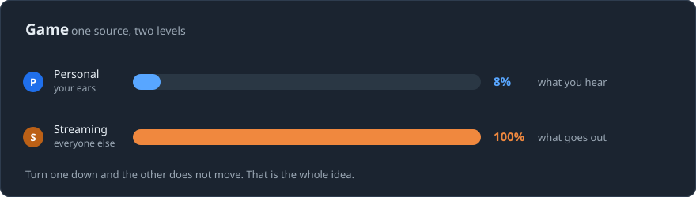
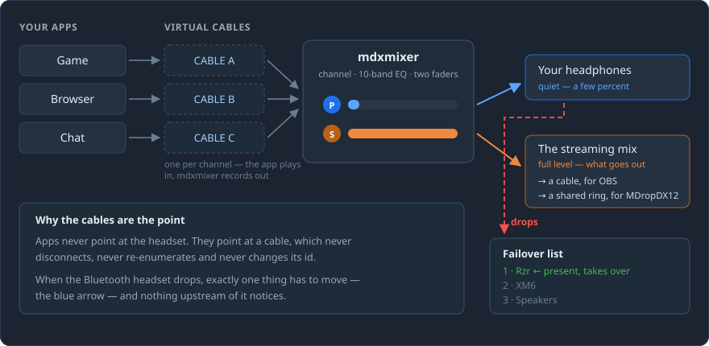
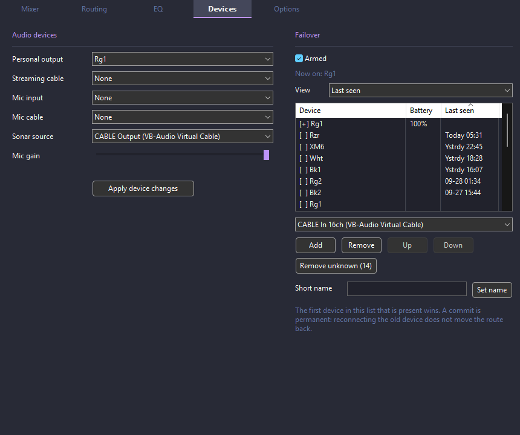
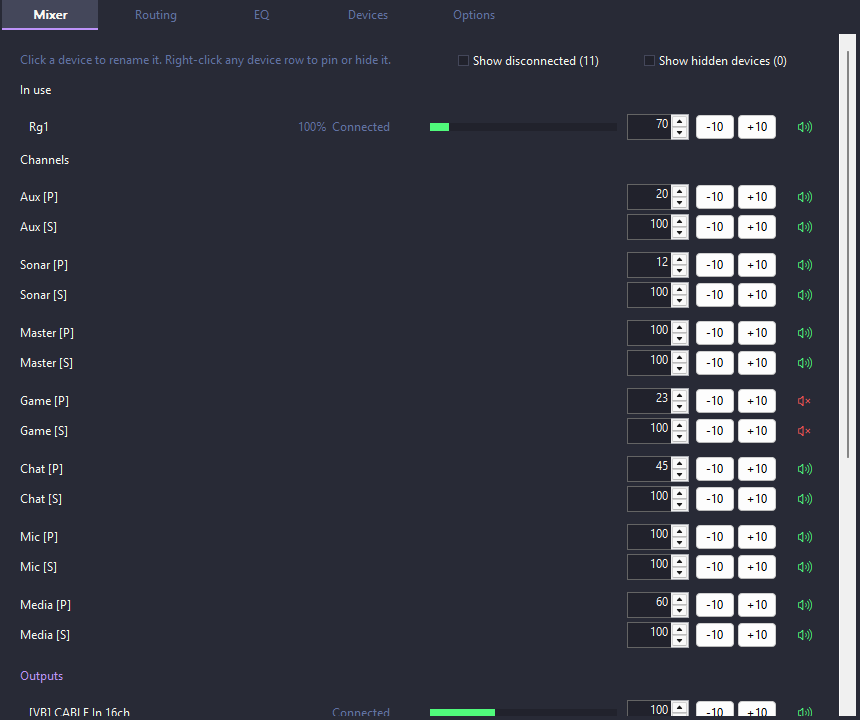

# mdxmixer

**Hear your games at a sane volume while everyone else hears them properly —
and keep your audio alive when your Bluetooth headset drops.**

A small Windows audio mixer. No account, no launcher, no background service:
one executable that keeps its settings in the folder you put it in.

---

## Where this came from

This started as a Bluetooth problem, not a mixer problem.

Picture the setup: a drawer of Bluetooth earbuds — five identical pairs of
WF-1000XM5s, an XM6, a Razer headset — swapped around through the day as
batteries run down. Bluetooth being Bluetooth, they drop. A lot.

On its own that would be a minor annoyance. The trouble is what the rest of
the machine does about it. When a Bluetooth headset disappears *suddenly*
rather than politely, Windows hands your audio to whatever it feels like,
usually the monitor speakers, at whatever volume they were last on. And if
you are running [SteelSeries Sonar](https://steelseries.com/gg/sonar) (free,
part of the SteelSeries GG suite), it gets worse: Sonar's engine would hang,
taking the routing for every app with it. The recovery was a three-step
ritual — disable Sonar, restart the Windows audio services, re-enable Sonar —
performed by hand, several times a day, often mid-session.

So the first thing this program did was not mix anything. It watched for the
headset going away and moved the audio somewhere sensible before Windows
could make a mess of it.

Everything else grew out of living with that:

- once something else owned the routing, **virtual cables** kept apps from
  ever pointing at a headset that might vanish;
- Sonar's best idea — **two levels per channel**, one for your ears and one
  for everyone else — was worth keeping even on the days Sonar was the
  problem, so it became the model the whole mixer is built around;
- once there were seven identically-named headsets in the list, they needed
  **short names** and a **last seen** column;
- and once the batteries were the thing that decided which pair you reached
  for, a small **floating battery readout** earned its place on screen.

Which leaves Sonar in an odd position here: it is both the thing that caused
this and a thing worth keeping. Its channels appear as ordinary faders and
mdxmixer drives both of their levels, but it is no longer load-bearing — it
can hang, come back late, or not come back at all, and the mixer carries on.
[docs/rollout.md](docs/rollout.md) walks through moving off it one app at a
time, in an order you can back out of at any step.

---

## The two faders

Every channel carries two levels, and they move independently.



If you stream, record, or share a call, you are running two mixes at once
whether or not your software admits it. Your ears want the game at a few
percent at one in the morning. Your audience wants it at a normal level. Turn
it down for yourself and the stream goes quiet; turn it up for the stream and
you flinch.

Here they are simply two numbers.

### Where the second number actually comes from

Worth being straight about, because the answer is probably Sonar.

Not much does this. Windows gives you one level per app, and the per-app
mixers give you a nicer version of one level per app — one number, however
many places the sound is going.

Two things have it properly:

- **[SteelSeries Sonar](https://steelseries.com/gg/sonar)**, free, in streamer
  mode. This is what most people with it are already using, and what mdxmixer
  drives today.
- **[Voicemeeter Potato](https://vb-audio.com/Voicemeeter/potato.htm)**, from
  the people who make the cables. Its `GainLayer` is a per-strip, per-bus gain
  — one input, an independent level for every output bus — which is the same
  idea under a different name.

  Note **Potato specifically.** Voicemeeter, Voicemeeter Banana and Voicemeeter
  Potato are three separate products, not tiers of one download, and Potato is
  the dearest. The cheaper two give one gain per strip plus per-bus masters,
  which is one number per channel however many places it goes — not this. So
  the cost of the two-fader model here is a real consideration, not a
  rounding error against the cables.

mdxmixer does not drive Voicemeeter yet. It is the better of the two targets
on paper — a documented C API (`VoicemeeterRemote.dll`, with an official
[SDK](https://github.com/vburel2018/Voicemeeter-SDK)) rather than an
undocumented local HTTP endpoint, and no write that reports success and then
does nothing.

**Through Sonar.** In streamer mode Sonar already maintains two separate mixes
— it calls them monitoring and streaming — for each of Aux, Media, Game, Chat,
Mic and Master. That is the same two-knob model, and it is the one doing the
work on a typical setup. mdxmixer shows those channels as ordinary rows and
drives both of Sonar's levels for you, which it has to do over Sonar's own
local API: Sonar's virtual devices will accept a Windows volume change, report
success, and quietly ignore it. **If you have Sonar, this is what you are
using, and it works today with no cables at all.**

**Through mdxmixer's own channels**, the split happens in its mixer instead —
one source, two gain stages, two sums. The personal sum goes to your
headphones. The streaming sum needs somewhere to go, and there are two places
it can:

- **A streaming cable.** Set one on the Devices tab and your recorder captures
  that cable, like any other input. This is the ordinary route.
- **The shared-memory ring**, for a program that wants the audio rather than a
  device. A client asks for it with `MDXM_FEED|1` and reads
  `Local\mdxmixer_stream_v1`; no cable, no driver, nothing to install. It is
  **off until something asks**, because when Sonar is working it is already
  mixing this audio and two live sources of it work against each other.
  Right now **MDropDX12 3.3+ is the only thing that reads it**, and that path
  is new enough to still want testing.

  This is the common case in practice, and it is worth being clear why: a
  visualiser wants to *see* your music, which is a different thing from a
  recorder wanting to *keep* it. Most of what comes out of these faders is
  other people's media, and sending it all to a recording by default would be
  the wrong instinct. An OBS plugin that read the ring would be easy enough
  to write — nobody has needed one.

If neither is set up, the streaming sum is computed and thrown away, so the
`[S]` fader on a native channel moves nothing anybody can hear. That is a
setting, not a limitation, but it is the step people miss.

So, in short:

| you have | the `[P]` fader | the `[S]` fader |
| --- | --- | --- |
| Sonar | works | works — Sonar keeps both mixes |
| a streaming cable | works | works — your recorder captures the cable |
| a feed subscriber | works | works — mdx12 3.3+ reads the ring |
| none of those | works | moves nothing |

The quiet-for-you half works in every row, because that is just your output
level, and it is the half that matters most of the time.

---

## How the audio actually gets there



**Apps never point at your headset.** They point at a virtual audio cable —
a driver that pretends to be a sound card, so whatever an app plays into one
end, mdxmixer can record out of the other. You install a handful of these once
and then forget they exist.

[**VB-CABLE**](https://vb-audio.com/Cable/) is what this was built against.
The base cable is **free** — *"VB-CABLE is a Donationware! All participations
are welcome"* — and that gets you exactly **one** cable. The **A+B** and
**C+D** packs are four more, and those come with a donation: *"Click on Donate
button below to get your personal download link!"*

One cable is further than it sounds, because it only has to carry the thing
that genuinely needs a device:

- **One app channel**, and everything else stays on your normal output.
- **Or** a streaming output for a recorder.
- **And the visualiser needs no cable at all** — `MDXM_FEED` hands the
  streaming mix to MDropDX12 through shared memory, so if that is where your
  second fader was going, the free cable is free to be used for something
  else.

Set every cable to **24-bit, 48000 Hz** on both its playback and recording
sides in `mmsys.cpl` — mismatched rates are the one setup mistake that
produces confusing results.

That indirection is the whole trick. A cable never disconnects, never
re-enumerates and never changes its id. So when the headset drops, exactly one
thing in the chain has to move — the last hop, from mdxmixer to your ears —
and not one application notices. That is the difference between a headset
dropping and your whole machine's audio rearranging itself around it.

Out the other side there are two mixes:

- the **personal** mix goes to your headphones, at your level;
- the **streaming** mix goes to another cable, which your recorder or
  streaming software records, at full level.

Your microphone works the same way in reverse: mdxmixer takes the real mic,
applies gain and EQ, and publishes it on a cable your voice apps use as their
input.

---

## Failover: what happens when it drops



An ordered list of outputs you would accept. When the one you are on
disappears, the first *present* device down the list takes over.

Deliberately unhurried. A device has to be steadily present for a few seconds
before it is trusted, and once a move is committed, plugging the old headset
back in does **not** drag your audio back. A Bluetooth link that is flapping
should not flap your audio with it.

Two things on that screen worth pointing out:

- **Short names.** Seven headsets called some variation of `Headphones (11-
  WF-1000XM5)` is a list nobody can read. Name one `Bk1` and the name follows
  that physical headset — across re-pairings, and even across changing your
  Bluetooth adapter, because the name is keyed to the headset's own address
  rather than to the pairing.
- **Last seen**, sortable, so "which of these did I actually use yesterday"
  has an answer.

The line at the top — **Now on: Rg1** — is always the device your audio is
coming out of this second, not the one you configured.

---

## The battery overlay


That is actual size. A frameless, always-on-top readout of every connected
headset's battery, colour-coded green through red, which answers "do I need
to swap pairs before this call" without opening anything.

It is **click-through by default**, so it cannot get in the way of what is
underneath it — but you can turn a frame on, **drag it anywhere**, resize it,
and the text scales to fit the box. Snap buttons put it in a display corner if
you would rather not aim. Set the opacity to taste, and write the text
yourself: `$sn:$b%` gives `Rg1:100%`, where `$sn` is the short name and `$b`
the battery. One line per headset, because two headsets showing at once
usually means one of them is not charging, and that is worth knowing.

---

## The mixer



The device you are listening through sits at the top under **In use**, so you
never have to hunt for it. Below that, every channel with its `[P]` and `[S]`
pair.

Notice `Game [P]` at 23 and `Game [S]` at 100 — quiet in the room, normal on
the stream. That is a Sonar channel, so both of those numbers are Sonar's own
monitoring and streaming levels, being driven from here. And the little green
bars: those are live meters, so you can see which row is actually making a
noise.

Right-click any row to move it, pin it to the top, hide it, or rename it.
Those two columns of `-10` / `+10` buttons are one of the two fader styles —
there is a checkbox on the Options tab to switch between step buttons and
sliders, depending on whether you would rather be precise or quick.

**If you have [SteelSeries Sonar](https://steelseries.com/gg/sonar)**, its own
channels — Aux, Media, Game, Chat, Mic and Master — show up here as ordinary
faders with the same two levels.
They have to be driven differently behind the scenes: Sonar's virtual devices
will accept a Windows volume change, report success, and quietly ignore it, so
mdxmixer asks Sonar directly instead.

---

## Install

Grab the latest from
[Releases](https://github.com/shanevbg/mdxmixer/releases):

**`mdxmixer-vX.Y.Z-portable.zip`** — unzip it anywhere and run
`mdxmixer.exe`. Settings live next to the exe, so the folder *is* the
installation: copy it to a stick, copy it to another machine, delete it to
uninstall.

**`mdxmixer-vX.Y.Z-x64.msi`** — a normal installer with a Start Menu entry and
an Apps-and-features listing. **No administrator needed** — it installs under
your own account, because mdxmixer keeps its settings beside itself and
Program Files is not somewhere you can write. Choose **Express** to get on
with it, or **Custom** to pick the folder and whether it starts when you sign
in.

### Free things you may want alongside it

| | | |
| --- | --- | --- |
| [**VB-CABLE**](https://vb-audio.com/Cable/) | **base cable free**, extras by donation | The virtual cables. The free one is a full, unlimited cable and is enough for one app channel or one streaming output — not needed at all if you only want control over the devices you already have. The **A+B** and **C+D** packs are four more and come with a donation. |
| [**SteelSeries Sonar**](https://steelseries.com/gg/sonar) | free | The way to get the two-fader split working **today**, because it keeps both mixes itself and mdxmixer already drives it — see above. This project exists partly because of Sonar's habit of taking the audio graph down with a Bluetooth headset, which is worth knowing before you lean on it. |
| [**Voicemeeter Potato**](https://vb-audio.com/Voicemeeter/potato.htm) | donationware, dearest of the three | Same people as the cables. Its `GainLayer` is a per-strip, per-bus gain, which is the two-fader model by another name. **Potato specifically** — Voicemeeter, Banana and Potato are three separate products at three prices, and only Potato has it. Not driven by mdxmixer yet, and the better target of the two: a documented C API instead of an undocumented HTTP endpoint. |
| [**MDropDX12**](https://github.com/shanevbg/MDropDX12) | free | The MilkDrop-style music visualiser this grew up alongside, and the thing most likely to be on the other end of the streaming mix. From **3.3** it reads that mix straight out of the shared-memory ring, so it needs no cable, no recording software and no extra audio device. It also drives this mixer over the pipe rather than touching Windows audio itself. |
| [**OBS Studio**](https://obsproject.com/) | free | Only if you actually record. It wants the streaming **cable**, not the ring — nothing reads the ring but MDropDX12 today, though an OBS plugin for it would be straightforward if anyone wanted one. Worth saying plainly: feeding a recorder everything you listen to is usually the wrong default, because most of it is other people's music. |

None of these is required to use mdxmixer as a plain volume mixer for the
devices you already have, with a failover list and a battery overlay. They
matter once you want the second fader to go somewhere.

---

## First run

1. **Devices tab** → set **Personal output** to the headphones you listen on.
   Two of the choices at the top of that list are automatic, and the
   difference matters:
   - *Follow the Windows default output* — whatever Windows is using.
   - *Use failover list* — ignore Windows, take the first device from your own
     list that is actually there.
2. **Mixer tab** → set your personal level. If your hearing is anything like
   the author's this will look absurdly low, and that is correct.
3. **Options tab** → turn on the battery overlay, and set a hotkey or two.

Hotkeys can drive as many channels at once as you like, and each key gets its
own step size — a coarse key for finding the range and a fine one for settling
are different keys.

---

## Driving it from another program

[MDropDX12](https://github.com/shanevbg/MDropDX12) keeps its own mixer window
but, when mdxmixer is running, reads and writes **through** it rather than
calling the Windows audio APIs itself. Two programs both moving endpoints is
how a route gets flapped between them, and the failover watcher has to be the
only one deciding.

Connect to `\\.\pipe\mdxmixer` and talk a line-oriented text protocol:
`MDXM_STATE` for everything, `MDXM_SUBSCRIBE|1` to be told when it changes,
`MDXM_FAILOVER` for the rule and what it currently sees, `MDXM_PEAK` four
times a second for which channel is making a noise.

If you want the audio itself rather than a description of it, `MDXM_FEED|1`
publishes the streaming mix into shared memory — this is the second home for
the `[S]` fader described above, and the one that needs no cable and no
driver. It stays off until asked. **MDropDX12 3.3 and later is currently the
only reader**, and new enough that it still wants testing.

Every verb is in **[docs/ipc.md](docs/ipc.md)**.

---

## Building it yourself

Visual Studio 2022 (v143) with the C++ workload. Nothing to fetch, no package
manager.

```text
.\build.ps1              # Debug
.\build.ps1 Release
.\build.ps1 Test
```

x64 only, so there is nothing to select. Binaries land in `bin\<Config>\`.

```text
.\release.ps1            # builds, runs the tests, writes the zip and the MSI
.\release.ps1 -ZipOnly   # skip the MSI, so WiX is not needed
```

The MSI needs WiX 5 — `dotnet tool install --global wix --version 5.*` and
`wix extension add -g WixToolset.UI.wixext/5.0.2`. Version 5 on purpose: 6 and
later require accepting a maintenance-fee licence, while 5 is free.

### Tests

```text
bin\Test\mdxmixer_test.exe            # headless, no audio hardware touched
bin\Test\mdxmixer_test.exe --audio    # cable-dependent integration tests
```

The headless suite runs anywhere: device ordering, name matching across
re-pairings, the failover state machine, the protocol parser, the ring buffer,
the peak meters. The `--audio` tests skip cleanly unless environment variables
name real endpoints (ids come from `mdxmixer --devices`):

| variable | meaning |
| --- | --- |
| `MDXM_TEST_RENDER` / `MDXM_TEST_CAPTURE` | channel cable pair (tone in / engine taps) |
| `MDXM_TEST_RENDER2` / `MDXM_TEST_CAPTURE2` | streaming cable pair (engine out / verification) |
| `MDXM_TEST_LOOPBACK=1` | capture ids equal render ids, tapped via WASAPI loopback — runs with no cable installed |
| `MDXM_TEST_PERSONAL` | personal-output endpoint for the graph tests |
| `MDXM_TEST_SOAK=1` | run the drift soak for the full 3 minutes |

Measurements are frequency-selective (a 440 Hz Goertzel bin), so music playing
on those endpoints does not break the assertions.

---

## Command line

Useful when something is wrong and you want to see what mdxmixer sees:

```text
mdxmixer                      the tray app (a second launch raises the first)
mdxmixer --levels             every endpoint: name, battery, last seen, volume
mdxmixer --devices            endpoint ids and names
mdxmixer --btinfo             Bluetooth containers, batteries, addresses
mdxmixer --sessions           what is playing, and whether per-app routing works
mdxmixer --sonarch            Sonar's channels and their two levels
mdxmixer --meter <id> 5       is Windows actually putting audio on this device?
mdxmixer --monitor <in> <out> passthrough: capture, cushion, render at unity
```

`--levels` and `--btinfo` are the two worth pasting into a bug report.

---

## Where things live

- **Settings:** `mdxmixer.json` beside the exe. Written atomically, with a
  `"complete": true` marker last, so a half-written file falls back to
  defaults rather than loading half a configuration.
- **Logs:** `log\mdxmixer.log` beside the exe.
- **What changed, and when:** [docs/Changes.md](docs/Changes.md).
- **Design and rationale:**
  [docs/specs/2026-09-22-mdxmixer-design.md](docs/specs/2026-09-22-mdxmixer-design.md).

The screenshots above are real, and regenerable: `MDXM_TAB` switches tabs and
`MDXM_CAPTURE` writes a PNG of a window, including the overlay, which is
otherwise unscreenshottable because it is frameless and click-through.

---

## Licence

CC-BY-NC 4.0 — see [LICENSE](LICENSE). Same terms and holder as MDropDX12,
which is what keeps the parts adapted from it clean.

Contributions are welcome; [CONTRIBUTING.md](CONTRIBUTING.md) explains the
snapshot-publishing shape of this repository.
